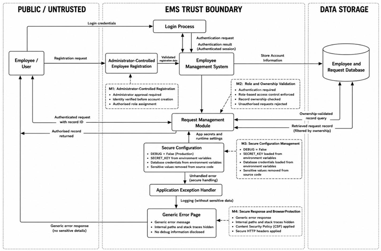
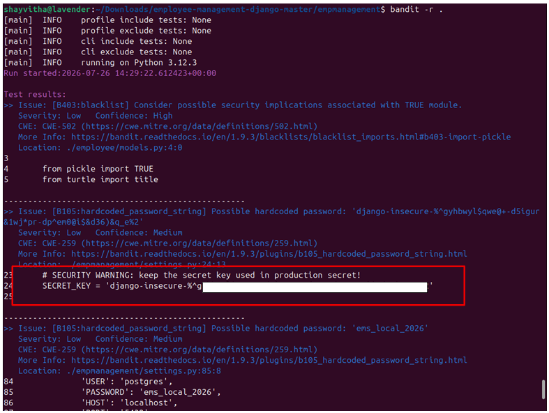
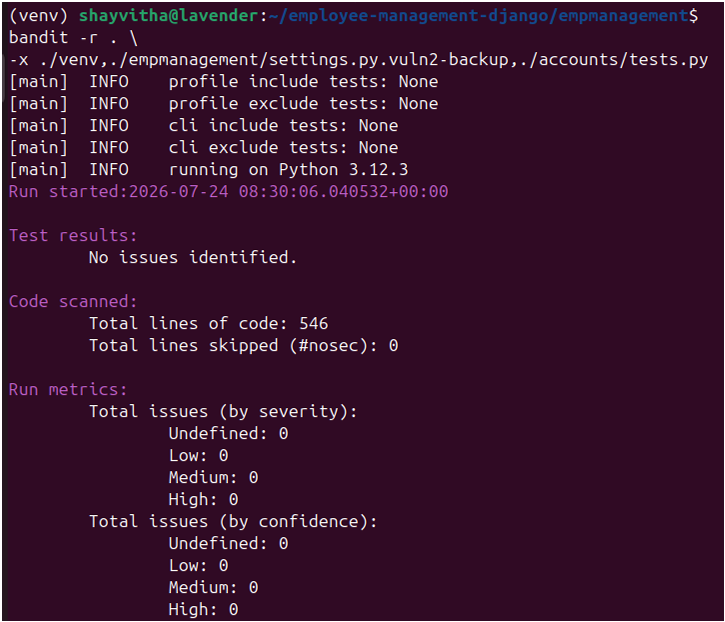
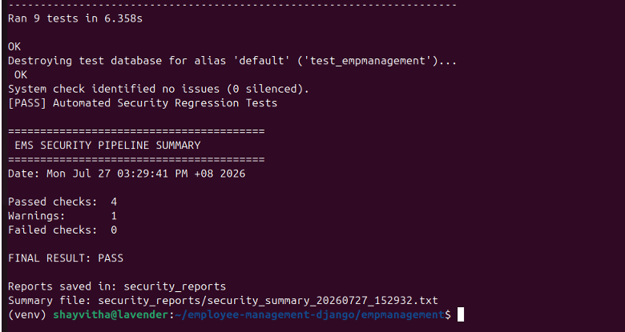

# Django Application Security Assessment & Hardening

A security assessment and hardening project performed against a locally deployed open-source Django Employee Management System, covering threat modelling, access-control remediation, secure configuration, SAST, SCA, DAST, manual validation and security regression testing.

**Upstream Application:** employee-management-django by omjogani

The original Employee Management System was not developed by me. My work focused on security assessment, remediation, hardening, and validation of a local copy for academic security testing. Please see the [Upstream Attribution](attribution/upstream-project.md) for full details.

## Security Engineering Highlights

- STRIDE-based threat modelling
- RBAC and administrator-only registration
- object-level authorization validation
- environment-based secret management
- secure error/debug configuration
- CSP/security-header hardening
- Bandit SAST
- pip-audit dependency scanning
- OWASP ZAP DAST
- Burp Suite manual validation
- regression/security validation
- automated security-testing workflow

## Assessment Workflow

```mermaid
graph TD
    A[Threat Modelling] --> B[Security Assessment]
    B --> C[Access Control & Configuration Hardening]
    C --> D[Static Analysis (Bandit)]
    D --> E[Dependency Analysis (pip-audit)]
    E --> F[Dynamic Testing (OWASP ZAP)]
    F --> G[Manual Validation (Burp Suite)]
    G --> H[Regression Testing]
    H --> I[Security Validation]
```

## Selected Findings & Remediation

| Area | Finding | Remediation | Validation |
|---|---|---|---|
| Public registration | Registration endpoint was publicly reachable. | Restricted registration to administrators only. | Access control testing |
| Access control | Insufficient role enforcement on privileged functionality. | Applied Role-Based Access Control (RBAC) restrictions. | Access control testing |
| Secrets/configuration | Sensitive configuration and secrets found in source files. | Migrated configuration to environment-based secret management. | SAST (Bandit) |
| Debug information disclosure | Application disclosed internal information on errors. | Disabled debug mode and secured error configurations. | Manual validation |
| Object authorization | Object-level authorization required validation. | Protected object access was included in authorization testing. | Manual validation |
| Dependency vulnerabilities | Known vulnerabilities identified in Python packages. | Updated and remediated Python dependencies. | SCA (pip-audit) |
| Security headers | Missing or weak HTTP security headers (e.g., CSP). | Configured security headers including Content Security Policy. | DAST (OWASP ZAP) |

## Security Testing

### Bandit
Bandit was utilized for static application security testing (SAST) to identify potential insecure code patterns, such as hardcoded secrets and insecure configurations.

### pip-audit
pip-audit was utilized for software composition analysis (SCA) to identify known vulnerabilities within the Python dependency tree.

### OWASP ZAP
OWASP ZAP was utilized for dynamic application security testing (DAST) to evaluate the running application for misconfigurations, security header implementation, and behavioral issues.

### Burp Suite
Burp Suite was utilized for manual web security validation, intercepting web requests to evaluate access-control enforcement and authorization behavior.

## Evidence

### Threat Architecture (Mitigated)


### Access Control (RBAC Denial)


### Static Analysis Before & After



### Automated Security Pipeline


## Documentation

| Document | Description |
|---|---|
| [Threat Model](docs/threat-model.md) | STRIDE methodology and architecture review. |
| [Security Assessment](docs/security-assessment.md) | Overview of methodology and categories assessed. |
| [Access Control](docs/access-control.md) | Authentication, authorization, and RBAC hardening. |
| [Configuration Hardening](docs/configuration-hardening.md) | Secrets management and security header implementation. |
| [SAST Analysis](docs/sast-analysis.md) | Bandit static analysis and remediation. |
| [Dependency Analysis](docs/dependency-analysis.md) | pip-audit dependency scanning and mitigation. |
| [DAST Analysis](docs/dast-analysis.md) | OWASP ZAP dynamic testing and validation. |
| [Remediation](docs/remediation.md) | Matrix of security findings and implemented fixes. |
| [Security Validation](docs/security-validation.md) | Validation strategy, pipeline, and limitations. |

## Limitations

This application was assessed locally. HTTPS-dependent controls could not be fully validated because the testing environment used local HTTP. A remaining deployment/security warning therefore requires validation under a real HTTPS deployment. Additionally, CSP-related observations were still present during later validation, which may require broader response coverage, policy refinement, and production validation. Security scanners provide evidence about the conditions they test; a clean scanner result does not prove that an application is completely secure. This repository contains selected sanitized evidence rather than the entire original testing environment.

## Attribution
Please see the [Upstream Attribution](attribution/upstream-project.md) document for details regarding the original Employee Management System source code.
