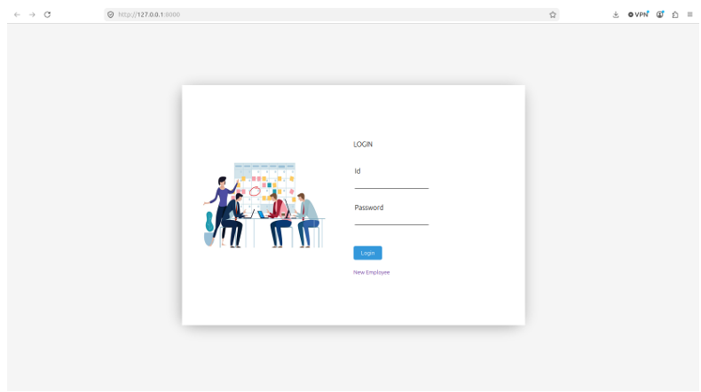
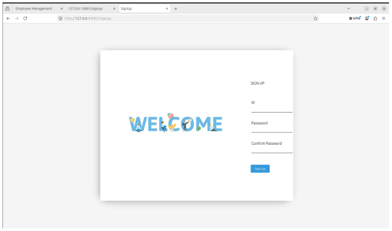
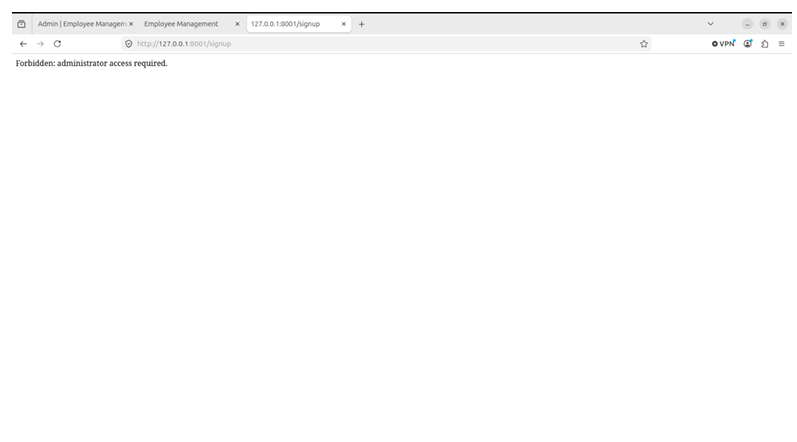
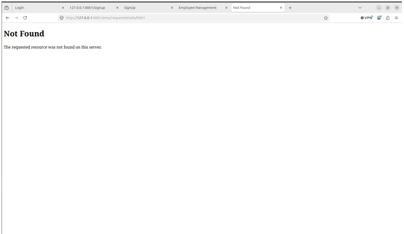

# Access Control Hardening

## Objective
To evaluate and enforce strict authentication and authorization boundaries within the application, ensuring users operate under the principle of least privilege.

## Scope
This assessment focused on user registration, session management, Role-Based Access Control (RBAC), and server-side authorization enforcement for both Employees and Administrators.

## Assessment Approach
Manual testing and request interception were utilized to evaluate how the application handled unauthorized access attempts, vertical privilege escalation, and unauthenticated state management.

## Findings
The assessment identified that account registration was publicly reachable. This weakness could allow unauthorized users to create accounts and gain authenticated access to the system.

**Initial Public Registration:**

Additionally, there were instances where authorization constraints did not strictly enforce the differences between basic authenticated users and administrative roles.

## Remediation
To enforce least privilege:
- **Registration Restriction:** The registration functionality was restricted to administrators only.
- **RBAC Enforcement:** Role-Based Access Control (RBAC) was applied across the application to prevent unauthorized employees from accessing privileged administrative functionality.
- **Object-Level Authorization:** Protected object access was included in authorization testing to ensure appropriate denial behavior.

## Validation
Validation confirmed that authentication (verifying user identity) and authorization (verifying permissions) were functioning correctly server-side.

**Administrator-Only Registration:**

**RBAC Denial of Unauthorized Access:**
Unauthorized employees attempting to access privileged functionality were successfully denied (HTTP 403 Forbidden).

**Object-Level Authorization Enforcement:**
Attempts to access unauthorized objects resulted in appropriate denial behavior (HTTP 404/403).

