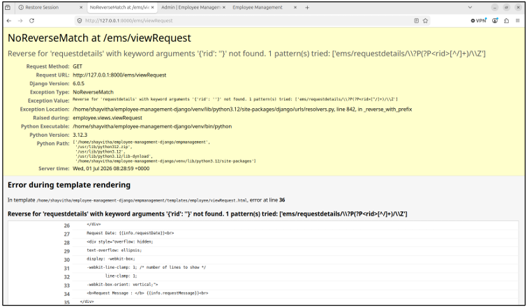
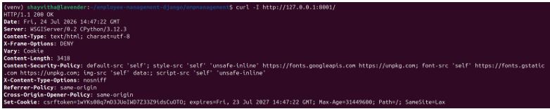

# Configuration Hardening

## Objective
To identify and secure sensitive application configurations, remove hardcoded secrets, and minimize information disclosure through HTTP responses and error messages.

## Scope
The review encompassed Django environment settings, database connection strings, error handling configurations, and HTTP security headers.

## Assessment Approach
Source code review and dynamic request analysis were performed to identify leaked secrets and assess the security posture of HTTP responses.

## Findings
The original assessment identified security-sensitive values stored directly in application settings. These included:
- Hardcoded Django `SECRET_KEY`.
- Database credentials stored in plain text.
- `DEBUG` configuration enabled.

The enabled debug configuration led to unnecessary internal information disclosure upon encountering application errors.

**Debug Information Disclosure:**

## Remediation
Remediation focused on establishing secure configuration practices:
- **Environment Variables:** Sensitive configuration data (secrets, credentials) was migrated to environment-based configuration to prevent hardcoding in source code and avoid leaking development configurations into production.
- **Error Handling:** Debug mode was disabled to prevent the leakage of internal stack traces and application details.
- **Security Headers:** HTTP security headers, including Content Security Policy (CSP), were configured to mitigate client-side attacks.

## Validation
Post-remediation validation demonstrated the successful application of secure configurations.

**Validated CSP and Security Headers:**

### Limitations
Because the testing environment utilized local HTTP, HTTPS-dependent controls (such as Secure/HttpOnly cookie attributes relying on TLS) could not be fully validated. A remaining deployment/security warning requires validation under a real HTTPS deployment.
