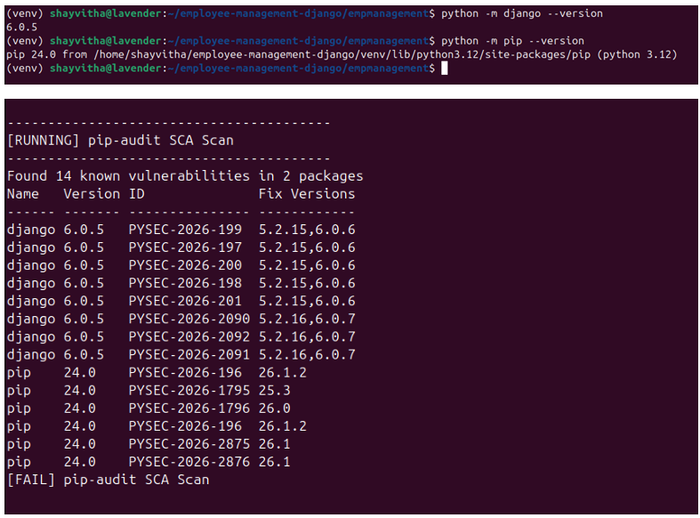
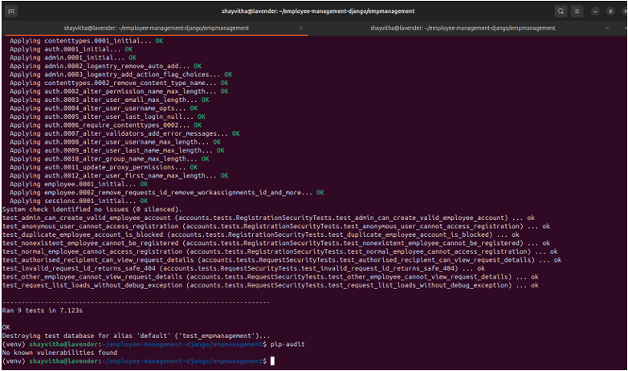

# Software Composition Analysis (SCA)

## Objective
To identify known vulnerabilities (CVEs) in third-party libraries and dependencies utilized by the application.

## Tool
**pip-audit**: A tool for scanning Python environments for packages with known vulnerabilities.

## Purpose of SCA
Modern applications rely heavily on external open-source packages. SCA ensures that these dependencies do not introduce known security flaws into the application.

## Initial Known Dependency Vulnerabilities
The initial dependency assessment identified known vulnerabilities in the tested dependency set. 

**Initial pip-audit Findings:**

## Dependency Upgrades
Vulnerable dependencies were updated to their secure versions as recommended by the security advisory data.

## Post-Remediation Scan
The post-remediation pip-audit scan reported no known vulnerabilities in the tested dependency set.

**Post-Remediation pip-audit Results:**

## Evidence
Artifacts related to the SCA process are documented in `security-artifacts/sca/`.

## Limitations of Dependency Scanning
SCA tools depend entirely on public vulnerability databases. A clean scan only means that no *currently known* vulnerabilities exist in the specific dependency versions used; it does not protect against zero-day vulnerabilities in those packages.
