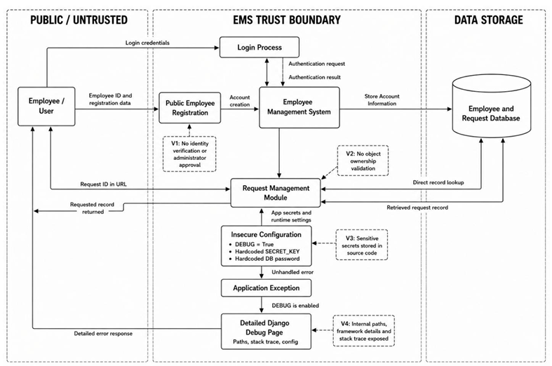

# Threat Model

## Objective
To analyze the architecture of the Employee Management System, identify potential security risks across trust boundaries, and determine necessary mitigations before technical assessment and validation.

## Scope
The threat model focuses on the core web application functionality, user roles (Employee and Administrator), data flows, and interactions with the backend PostgreSQL database. It specifically targets authentication, authorization, configuration management, and object access boundaries.

## Assessment Approach
The application was assessed using a Data Flow Diagram (DFD) and the STRIDE methodology (Spoofing, Tampering, Repudiation, Information Disclosure, Denial of Service, Elevation of Privilege) to identify and categorize threats systematically.

## Findings
The initial threat model identified several high-priority concerns, specifically in areas involving:
- Unrestricted public account registration.
- Weak authorization checks for employee access.
- Potential exposure of debug/error information.
- Hardcoded secrets and insecure configuration.
- Validating object-level authorization bounds.
- Missing HTTP security headers (e.g., CSP).
- Dependencies with known vulnerabilities.

### Initial Threat Architecture

## Remediation & Mitigation Strategy
The identified risks were addressed through a combination of configuration hardening, access-control restrictions, and code modifications. Mitigations included restricting registration to administrators, enforcing RBAC, and moving secrets to environment variables.

### Mitigated Threat Architecture

